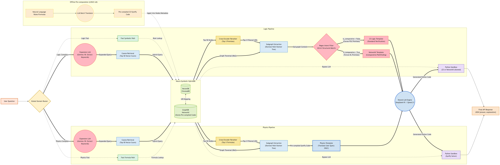

# 🎯 Neuro-Symbolic RAG
This project completely replaces traditional text-based RAG (BM25) to eliminate LLM hallucinations. It leverages a Neuro-Symbolic HybridDB to map Logic and Physics knowledge as a topological network, heavily augmented with Offline Pre-computation, Graph Traversal (Steiner Tree), and Adaptive Routing.

## 🧠 System Architecture


The pipeline consists of 4 core components:

### 1. Adaptive Intent Router (Zero-LLM Overhead)
A hardware-aware router that categorizes queries instantly without consuming LLM resources:
- **Static NLP**: Uses `spaCy` (`en_core_web_sm`) to calculate query complexity ($\kappa$) and measure computational pressure ($R_p$).
- **Dynamic Routing**: Automatically routes queries to the **Fast Path** or **Hybrid Path** to optimize speed and prevent OOM issues.

### 2. HybridDB (Shared Knowledge Base)
Formulas and rules are stored across two parallel formats:
- **VectorDB (ChromaDB)**: Uses `BAAI/bge-small-en-v1.5` for lightning-fast semantic retrieval.
- **GraphDB (NetworkX)**: Maps causal structures and topologies, utilizing PageRank for knowledge ranking.
- **Learned Predicate Schema**: Aligns NL and FOL premises from the training data,
  keeps only confidence-consistent mappings, and caches the learned lexicon by
  dataset fingerprint. It never reads answer labels; all answers still require
  a Horn/Z3 proof.

If the embedding model is not available locally, retrieval falls back to a
lexical index instead of blocking startup on a network download. Set
`EXACT_RETRIEVAL_ALLOW_DOWNLOAD=true` only when model downloads are intended.

### 3. Execution Paths
- ⚡ **Fast Path**: Direct VectorDB lookup. Bypasses the LLM entirely and executes static code if the confidence score is high.
- 🔍 **Hybrid RAG Path**: Uses a secondary model (Gemma 1B) for keyword extraction (Query Expansion) prior to retrieval. Includes Coordinate Guardrails to prevent spatial hallucinations.
- 💻 **Code Generation**: The Main LLM generates precise Python/Z3/SymPy code to solve the extracted problem.

### 4. Python Sandbox Executor
A completely isolated execution environment:
- **Security**: Blocks hazardous modules (`os`, `sys`, `exec`, `eval`).
- **Constraints**: Enforces a strict 4.0s timeout and only permits math libraries (`math`, `sympy`, `z3`).


---

## 🚀 Quick Start 

### Step 0: Download Model (One-time setup)
Create a `model/` directory and download the required GGUF weights:
```bash
mkdir -p model

# Download Main LLM (Qwen3-8B-GGUF)
wget https://huggingface.co/Qwen/Qwen3-8B-GGUF/resolve/main/Qwen3-8B-Q4_K_M.gguf -O model/Qwen3-8B-Q4_K_M.gguf
```

### Step 1: Start the Single LLM Server
Run the LLM process locally in a terminal:

**Terminal 1 (Main LLM - Orchestration, Math & Z3/SymPy Code Generation):**
```bash
llama-server -m model/Qwen3-8B-Q4_K_M.gguf \
  --host 0.0.0.0 --port 8001 -c 8192 --alias Qwen3-8B-Instruct \
  -ngl 99 --parallel 4 --flash-attn on --jinja \
  --reasoning off --reasoning-budget 0 \
  --chat-template-kwargs '{"enable_thinking":false}'
```

The client also sends `chat_template_kwargs.enable_thinking=false` and `/no_think`
on every Qwen3 request. Keeping the server switches above makes non-thinking mode
the process-wide default as well, including callers outside this pipeline.

### Step 2: Initialize the Database (Seeding)
*(Note: Run this only once to build the GraphDB nodes. If you update the VectorDB, you must run this again. Otherwise, you don't need to run this again).*
```bash
EXACT_LLM_BASE_URL=http://localhost:8001 EXACT_LLM_MODEL=Qwen3-8B-Instruct python3 scripts/auto_seeder.py
```

### Step 3: Start the API Gateway
Open a third terminal and run Docker to start the central API Server on port `8000`:
```bash
docker-compose up --build exact-api -d
```
*(Note: The API Gateway on port 8000 is fully configured to handle `/predict` for answering queries and to dynamically aggregate metadata from both LLMs for the `/v1/models` endpoint).*

### Step 4: Expose Localhost to the Internet (Tunneling)
For the committee to evaluate your system, you **only need to expose port 8000** to the internet. Run ngrok (or cloudflared):
```bash
ngrok http 8000
```
The system will generate a public URL (e.g., `https://<random-id>.ngrok-free.app`).

### Step 5: Test the Public API
Use the following `curl` command (replace `<YOUR_NGROK_URL>` with your actual ngrok link from Step 4) to simulate the committee's evaluation tool:
```bash
curl -X POST <YOUR_NGROK_URL>/predict \
  -H "Content-Type: application/json" \
  -H "ngrok-skip-browser-warning: true" \
  -d '{
    "query_id": "T1_0001",
    "type": "type1",
    "query": "Is Student A eligible for graduation?",
    "premises": [
      "A student who has completed at least 120 credits is eligible for graduation.",
      "Student A has completed 118 credits."
    ],
    "options": ["Yes", "No", "Uncertain"]
  }'
```
Or use the streamlit app to test (The default port is 8501):
```bash
python3 -m streamlit run exact_pipeline/app.py
```

### Step 6: Prepare `urls.txt` for Submission
Create a file named `urls.txt` (to be placed in your final submission ZIP) and add the following two lines (replace with your actual ngrok domain):
```text
<YOUR_NGROK_URL>/predict
<YOUR_NGROK_URL>/v1/models
```
*The committee will use the first link to send 50 test JSON queries, and the second link to verify that your single LLM setup stays within the 8B Parameter limit!*

---

## 📂 Core Folder Structure

```text
EXACT-Full-Pipeline/
├── Diagram/                     # System architecture diagrams
├── docs/                        # Solution documentation
├── test_client.py               # Automated interaction client
├── test_debug.py                # Debug API calls
├── test_llm_direct.py           # Direct LLM connection tests
│
└── exact_pipeline/              # MAIN SOURCE CODE
    ├── Full-Pipeline-Exact-2026.png 
    ├── docker-compose.yml       # Docker deployment config
    ├── Dockerfile               # Environment package
    ├── requirements.txt         # Python dependencies
    ├── app.py                   # Streamlit Web UI
    ├── dataset/                 # Raw Data & VectorDB/GraphDB storage
    ├── model/                   # LLM weights (.gguf)
    │
    ├── api/                     
    │   └── server.py            # API Gateway for /predict and /v1/models
    ├── core/                    # Configs & Pydantic models
    ├── engines/                 
    │   ├── executors.py         # Python Sandbox (Isolated execution)
    │   ├── logic.py             # First-Order Logic reasoning
    │   └── physics.py           # Physics formula parsing
    ├── knowledge/               # HybridDB processors
    │   ├── graph_db.py          # NetworkX: Topology, causality, PageRank
    │   └── retrieval.py         # ChromaDB: Vector Extraction
    ├── llm/                     
    │   ├── llm.py               # HTTP Client for vLLM/llama.cpp
    │   └── templates.py         # System Prompts (Jinja2)
    ├── orchestration/           
    │   ├── router.py            # Intent Router (Logic/Physics)
    │   └── pipeline.py          # Execution Pipeline
    │
    ├── scripts/                 
    │   ├── auto_seeder.py       # HybridDB Auto-seeder
    │   └── evaluate_local.py    # Local Accuracy evaluation
    ├── tests/                   
    │   ├── smoke_test.py        # Module quick tests
    │   └── test_custom.py       # Custom query API caller
    └── utils/                   # Shared utilities
```
