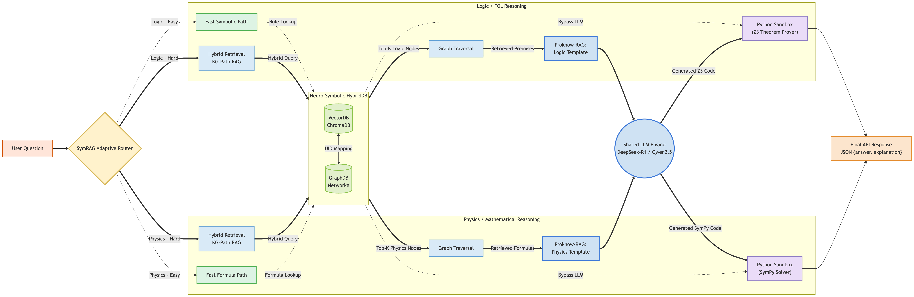

# EXACT 2026 Full Pipeline



Một giải pháp tiên tiến **Neuro-Symbolic AI** cho bài toán **The 2nd International XAI Challenge for Transparent Educational Question-Answering**. 

Pipeline này không sử dụng RAG văn bản (BM25) truyền thống dễ gây "ảo giác" (Hallucination). Thay vào đó, nó xây dựng một **HybridDB** (kết hợp VectorDB và GraphDB) để lập bản đồ tri thức Toán/Lý/Logic dưới dạng Mạng lưới liên kết (Topology).

---

## Kiến Trúc Neuro-Symbolic

Luồng xử lý chính (Workflow):

1. **Adaptive Intent Router:** 
   Nhận JSON query (chứa `question`, `query_type`, `premises`). Phân loại câu hỏi thành `logic` (Type 1) hoặc `physics` (Type 2).
   
2. **HybridDB (Shared Knowledge Base):**
   Mỗi công thức hoặc quy luật được lưu trữ ở 2 dạng đồng bộ 1-1 (cùng UID):
   - **VectorDB (ChromaDB):** Xử lý ngôn ngữ mờ (Semantic Similarity).
   - **GraphDB (NetworkX):** Xử lý cấu trúc nhân quả và topology (PageRank).

3. **Luồng Xử Lý Logic (Type 1):**
   - **Fast Path:** Tra cứu trực tiếp quy luật (k=1). Nếu khớp, Bypass LLM và chạy thẳng Python Sandbox (Z3).
   - **Hybrid RAG Path:** Lấy Top-K Node từ HybridDB, sau đó **Duyệt Đồ Thị (Graph Traversal)** men theo các dây liên kết `feeds_into` để bốc thêm các quy luật hàng xóm tạo thành chuỗi suy luận.
   - Giao việc cho LLM sinh mã Python Z3.

4. **Luồng Xử Lý Vật Lý (Type 2):**
   - **Fast Path:** Tra cứu trực tiếp công thức. Bypass LLM và chạy thẳng Python Sandbox (SymPy).
   - **Hybrid RAG Path:** Men theo các dây liên kết `shares_variable` (chung biến số) để gom đủ công thức giải hệ phương trình.
   - Giao việc cho LLM sinh mã Python SymPy.

5. **Python Sandbox Executor:**
   Mã do LLM sinh ra bị cô lập hoàn toàn (cấm `os`, `sys`, `exec()`, `eval()`), ép thời gian chạy (4.0s) và giới hạn chỉ dùng thư viện toán học an toàn (`math`, `sympy`, `z3`). Đảm bảo kết quả chính xác 100%, không sai toán học.

---

## Chạy Nhanh Toàn Bộ Hệ Thống

### 1. Khởi tạo Cơ Sở Dữ Liệu (Seeding)
Hệ thống cần đọc file gốc (`Logic_Based_Educational_Queries.json` và `Physics_Problems_Text_Only.csv`) để tự động bóc tách và đúc thành các Node trong GraphDB.
*Lưu ý: Bạn chỉ cần chạy lệnh này 1 lần duy nhất.*
```bash
EXACT_LLM_BASE_URL=http://localhost:8001 EXACT_LLM_MODEL=exact-model python3 scripts/auto_seeder.py
```

### 2. Khởi động Máy chủ API & LLM (Docker Compose)
Khởi động API Server (chạy ở cổng 8000) và LLM Server (chạy ở cổng 8001).
```bash
docker-compose up --build exact-api -d
docker-compose start exact-api (dùng để mở lại không cần build)
```
Nếu bạn muốn chạy mô hình `llama-cpp` cục bộ qua docker:
```bash
docker-compose up -d llama-cpp
```

*(Lưu ý cho máy Mac M-Series):* Cách tối ưu nhất để tận dụng card đồ họa (Metal acceleration) là không dùng Docker cho LLM, mà hãy cài đặt và chạy `llama-server` trực tiếp trên máy chủ gốc (Host) bằng lệnh sau:
```bash
llama-server -m model/deepseek-r1-distill-qwen-7b-exact.Q4_K_M.gguf \
  --lora model/exact-lora.gguf \
  --host 0.0.0.0 --port 8001 -c 16384 --alias exact-model 
  -ngl 99 --parallel 1 --flash-attn

llama-server -m model/Qwen2.5-7B-Instruct-Q4_K_M.gguf \
  --host 0.0.0.0 --port 8001 -c 16384 --alias exact-model \
  -ngl 99 --parallel 1 --flash-attn on
```

---

## Gọi API (Testing)

Endpoint chính để giải toán: `POST http://localhost:8000/answer`

**Ví dụ Gửi Câu Hỏi Vật Lý:**
```bash
curl -s http://localhost:8000/answer \
  -H 'Content-Type: application/json' \
  -d '{
    "query_type": "type2",
    "question": "Calculate the energy stored in capacitor C when C = 100 μF and U = 30 V."
  }'
```

**Hoặc chạy file test có sẵn:**
```bash
python3 test_custom.py
```

---

## Cấu Trúc File & Thư Mục Quan Trọng

Dưới đây là sơ đồ thư mục của dự án sau khi tái cấu trúc:

```text
EXACT-Full-Pipeline/
├── Diagram/                     # Chứa sơ đồ kiến trúc
├── docs/                        # Chứa các tài liệu giải pháp (Solution) và khai báo dữ liệu
├── test_client.py               # Công cụ kiểm thử tương tác tự động
├── test_debug.py                # Script dùng để gọi API kiểm thử và debug
├── test_llm_direct.py           # Gọi thử nghiệm LLM trực tiếp
│
└── exact_pipeline/              # Mã nguồn cốt lõi của hệ thống Neuro-Symbolic
    ├── Full-Pipeline-Exact-2026.png # Hình ảnh sơ đồ pipeline
    ├── docker-compose.yml       # Cấu hình khởi chạy nhanh API và LLM
    ├── Dockerfile               # Tệp tin cấu hình đóng gói Docker
    ├── dataset/                 # Chứa dữ liệu gốc (JSON, CSV) và VectorDB/GraphDB
    ├── model/                   # Nơi lưu trữ trọng số mô hình LLM (.gguf, LoRA)
    ├── scripts/                 # Các công cụ hỗ trợ
    │   ├── auto_seeder.py       # Kịch bản tự động nạp và cấy dữ liệu vào HybridDB
    │   └── evaluate_local.py    # Kịch bản đánh giá độ chính xác (Accuracy)
    ├── tests/                   # Kịch bản kiểm thử (Smoke test)
    │   ├── smoke_test.py        # Chạy kiểm tra nhanh hệ thống
    │   └── test_custom.py       # Gọi API cho câu hỏi tùy biến
    ├── core/                    # Cấu hình (config.py) và định dạng dữ liệu (models.py)
    ├── engines/                 # Chứa Logic (Z3) / Physics (SymPy) pipelines 
    │   └── executors.py         # Môi trường Python Sandbox cách ly bảo mật
    ├── knowledge/               # Thư mục phụ trách HybridDB
    │   ├── graph_db.py          # NetworkX GraphDB và hàm tính điểm PageRank + Vector
    │   └── retrieval.py         # VectorDB (ChromaDB)
    ├── llm/                     # Xử lý giao tiếp với LLM
    │   ├── llm.py               # HTTP Client gọi tới LLM (vLLM / llama.cpp)
    │   └── templates.py         # Nơi chứa các System Prompt (Jinja2)
    └── orchestration/           
        ├── router.py            # Bộ định tuyến (Intent Router) chia luồng Logic/Physics
        └── pipeline.py          # API Server chính (FastAPI/Flask)
```
